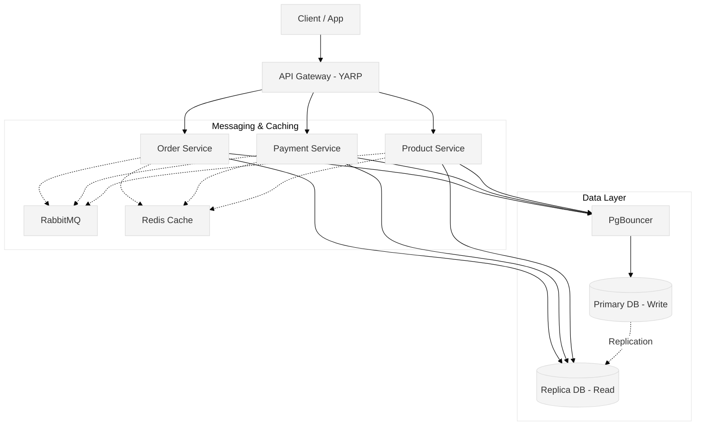

# Microservices Architecture Platform

This project is a comprehensive example of a modern, distributed e-commerce platform built with **.NET 8**, **PostgreSQL**, **Redis**, **RabbitMQ**, and **Docker**. It is designed to demonstrate real-world patterns like CQRS, Saga Choreography, Transactional Outbox, and Multi-Tenancy.

---

## 1. Architecture of the Project

The platform consists of three core microservices and an API Gateway. The architecture is designed to be highly decoupled, scalable, and resilient to failures.



### Components
- **API Gateway (YARP)**: The single entry point for clients. Handles routing, rate limiting, and forwards multi-tenant headers (`X-Country`).
- **Order Service**: Manages the order lifecycle (Pending, Confirmed, Cancelled).
- **Payment Service**: Processes charges and refunds idempotently.
- **Product Service**: Manages catalog and inventory levels.

---

## 2. How to Run the Project

The entire system is containerized. To run it locally:

1. Ensure **Docker Desktop** is running.
2. Open a terminal in the root directory (where `docker-compose.yml` is).
3. Run the following command to build and start the containers in the background:
   ```bash
   docker compose up --build -d
   ```
4. **Check status**: `docker compose ps`
5. **View logs**: `docker compose logs -f api-gateway order-service`
6. **Stop**: `docker compose down -v` (The `-v` removes volumes and resets databases).

---

## 3. How to Apply Migrations

We use Entity Framework (EF) Core for database migrations.

### Generating a Migration Script
You can export migrations to a raw SQL file without needing a database connection:
```bash
dotnet ef migrations script -o migration.sql
```

### Applying Migrations
**Important**: When running `dotnet ef migrations add <Name>`, EF Core only analyzes your code and does **not** need a real database connection. 

You only need a valid, reachable connection string when running:
```bash
dotnet ef database update
```
*Note: In this project, databases and tables are often initialized automatically via startup scripts in the infrastructure folder.*

---

## 4. Inter-Service Communication (HTTP Client)

While asynchronous events are used for business processes, synchronous HTTP calls are used for immediate queries between services.

- **Typed HTTP Clients**: Registered in `OutboundHttpServiceCollectionExtensions.cs`.
- **Header Propagation**: The `HeaderPropagationHandler` automatically forwards headers like `X-Country` (for multi-tenancy) and `Authorization` to downstream services.
- **Resilience**: We use **Polly** pipelines to handle transient network failures. For example:
  - **Read Pipeline**: 3 retries, 10s timeout, circuit breaker.
  - **Critical Pipeline**: 2 retries, 15s timeout, aggressive circuit breaker.

---

## 5. The Saga Pattern

In distributed systems, a single business process often spans multiple microservices. 

### Orchestration vs Choreography
- **Orchestration**: A central "Controller" service tells all other services what to do. (Pros: easier to track. Cons: single point of failure, tight coupling).
- **Choreography**: Services publish events, and other services react to them independently. There is no central controller. (Pros: highly decoupled. Cons: harder to track the full flow).

### How it is applied in this project
This project uses **Saga Choreography**.

**Example Flow (Successful Order)**:
1. **Order Service** creates an order (`Status: Pending`) and publishes an `OrderCreated` event.
2. **Payment Service** consumes `OrderCreated`, processes the payment, and publishes `PaymentSucceeded`.
3. **Order Service** consumes `PaymentSucceeded` and updates the order to `Status: Confirmed`.
4. **Product Service** consumes `PaymentSucceeded` and deducts the inventory stock.

If the payment fails, the Payment Service publishes `PaymentFailed`, and the Order Service reacts by cancelling the order (a compensating transaction).

---

## 6. Database & Replication

The project uses a **Command Query Responsibility Segregation (CQRS)** pattern at the database level to scale read and write operations independently.

### Physical Replication
The project uses **Physical Replication** (not logical). 
- The Primary Database (`write-db`) handles all `INSERT / UPDATE / DELETE` commands.
- The Replica Database (`read-db`) handles all `SELECT` queries.
- Replication is achieved using PostgreSQL's `pg_basebackup` utility and replication slots.

### The Startup Scripts
- `write-startup.sh`: Starts the primary DB, configures authentication, creates replication users, and idempotently creates the databases.
- `read-startup.sh`: Waits for the primary DB, uses `pg_basebackup` to clone the primary's data physically, and starts up as a hot standby replica.

### Read/Write Separation in Application
- **Writes**: Route through **PgBouncer** (port `6432`) to the Primary DB to pool connections and prevent exhaustion.
- **Reads**: Application queries bypass PgBouncer and connect **directly** to the Read Replica to offload heavy query traffic.

---

## 7. Idempotency

**Idempotency** ensures that an operation can be applied multiple times without changing the result beyond the initial application. This is critical in distributed systems where network retries or duplicate messages occur.

### How it is applied in this project
1. **Redis (Payment Processing)**: When the Payment Service receives a request, it stores an idempotency key in Redis. If the same request (e.g., a network retry) arrives, it returns the cached success response rather than double-charging the user.
2. **Inbox Pattern (RabbitMQ)**: Services deduplicate incoming asynchronous events by storing the event's `MessageId` in an Inbox table in the database. If RabbitMQ accidentally delivers the same event twice, the service simply ignores it.

---

## 8. RabbitMQ & Multi-Tenancy

RabbitMQ acts as the message broker for asynchronous communication.

### Connections and Channels
- **Connections**: TCP connections to RabbitMQ are heavy and expensive. The project uses a `RabbitMqConnectionRegistry` to maintain exactly **one TCP connection per provider** (tenant).
- **Channels**: Channels are lightweight virtual connections over the TCP link. However, they are not thread-safe. The project uses a `RabbitMqChannelPool` (backed by a `ConcurrentBag<IModel>`) to safely rent and return channels for publishing messages.

### Multi-Tenant Architecture
The platform serves multiple countries (Egypt and USA), determined by the `X-Country` HTTP header. 
- The `init-topology.sh` script dynamically sets up isolated environments in RabbitMQ.
- **Egypt Tenant**: Has its own exchange (`Egypt.order.exchange`) and queues (`Egypt.order.Q`).
- **USA Tenant**: Has its own exchange (`USA.order.exchange`) and queues (`USA.order.Q`).
- This ensures data isolation and prevents a spike in traffic in one country from affecting the processing speed of another country.
