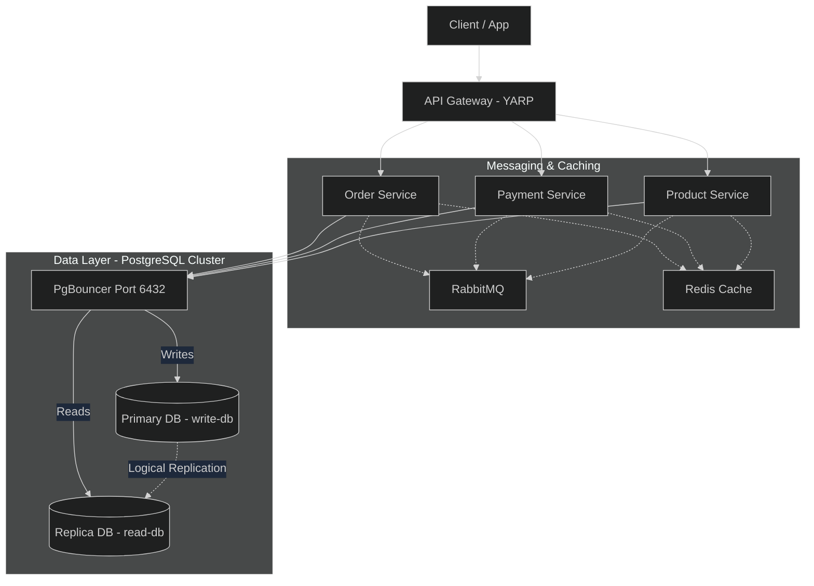
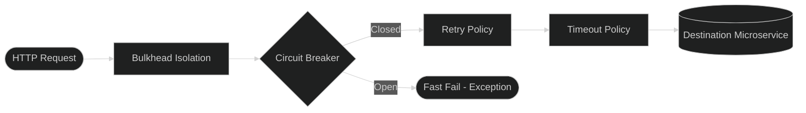
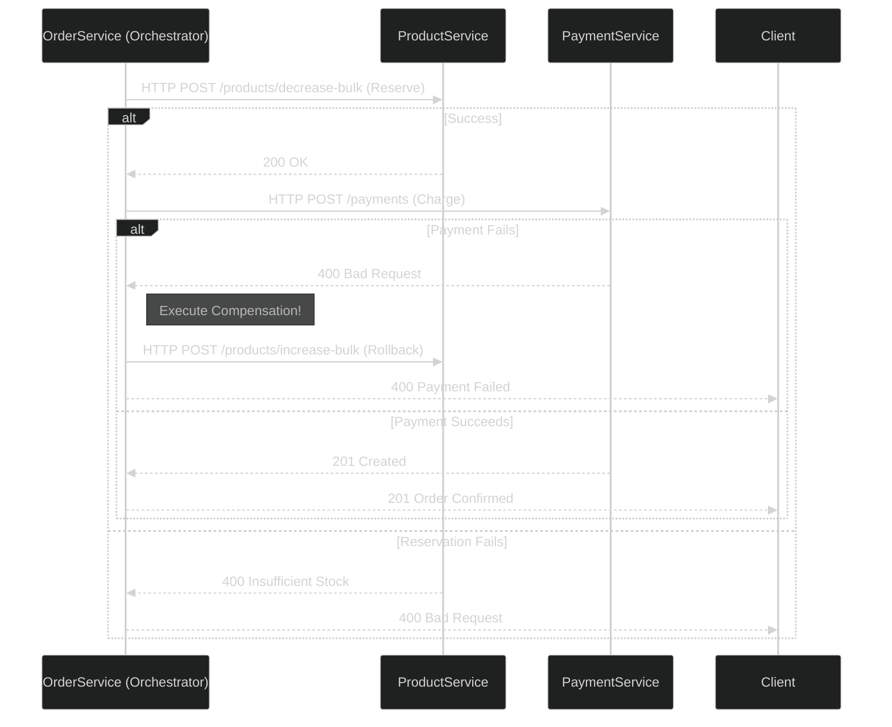
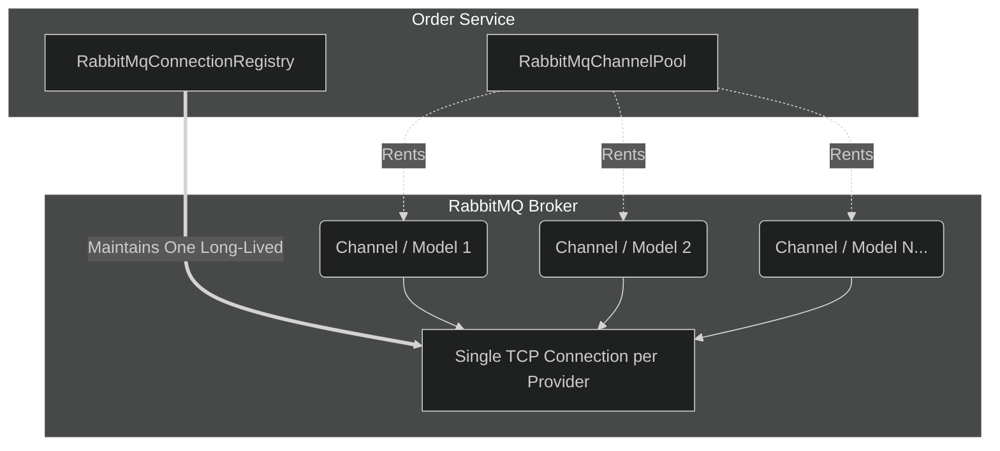
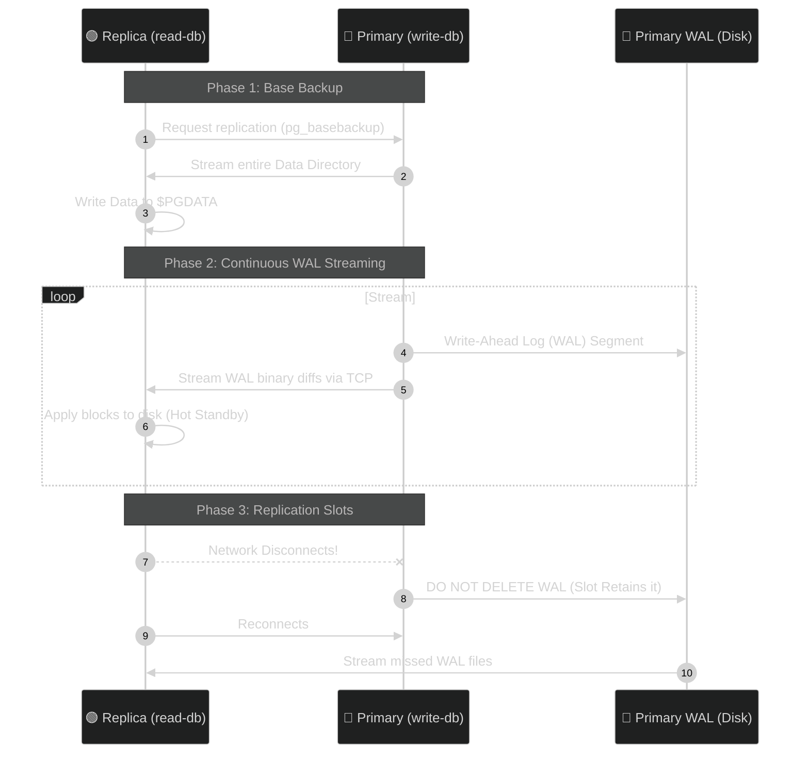

# Microservices Architecture Platform

This project is a comprehensive example of a modern, distributed e-commerce platform built with **.NET 8**, **PostgreSQL**, **Redis**, **RabbitMQ**, and **Docker**. It demonstrates real-world patterns like CQRS, Saga Orchestration vs Choreography, Transactional Outbox, Multi-Tenancy, and advanced Connection Pooling.

---

## 1. Architecture of the Project

The platform consists of three core microservices and an API Gateway. The architecture is designed to be highly decoupled, scalable, and resilient to failures.

> [!IMPORTANT]
> **Data Access Rule**: All database traffic (both READ and WRITE) MUST route through **PgBouncer** to prevent connection exhaustion. Read operations never bypass the connection pooler.



### Components
- **API Gateway (YARP)**: The single entry point for clients. Handles routing, rate limiting, and forwards multi-tenant headers (`X-Country`).
- **Order Service**: Manages the order lifecycle (Pending, Confirmed, Cancelled).
- **Payment Service**: Processes charges and refunds idempotently.
- **Product Service**: Manages catalog and inventory levels.

---

## 2. Advanced HTTP Communication & Resilience (Polly)

Synchronous communication between microservices relies heavily on `HttpClient` configured with advanced Polly pipelines to ensure system stability during network hiccups.

### The Pipeline Architecture

The platform dynamically injects Polly resilience policies into strongly-typed HTTP clients via `OutboundHttpServiceCollectionExtensions.cs`. We never rely on default HTTP timeouts.



### Specific Use Cases

1. **Write Pipeline (Product Service)**: Used for mutating state (e.g., deducting stock).
   - **Configuration**: Zero retries (to prevent double deduction), 12-second timeout.
   - **Why?**: Idempotency is hard to guarantee for generic POSTs; we rely on the Saga compensation rather than aggressive HTTP retries.
2. **NoRetry Pipeline (Payment Service)**: Used for highly sensitive financial transactions.
   - **Configuration**: Strict zero retries, 10-second timeout, aggressive circuit breaker.
   - **Why?**: If the payment gateway hiccups, we fail fast and refund/restore stock instead of blindly retrying and potentially double-charging a customer.
3. **Multi-Tenancy via HTTP**: The `HeaderPropagationHandler` automatically intercepts outgoing requests and attaches the `X-Country` header, ensuring downstream services act on the correct tenant's database.

---

## 3. Saga Pattern: Orchestration vs. Choreography

Distributed transactions cannot use traditional ACID database locks. We must use a Saga. Our platform implements both paradigms depending on the strictness required by the workflow.

### A. Saga Orchestration (Used in `CreateOrderUseCase`)
In an Orchestrated Saga, one central controller explicitly tells other services what to do via synchronous HTTP Commands.

**How we use it:**
The `OrderService` orchestrates the order creation because we want immediate, synchronous feedback to the user and strict transaction control.
- **State Machine**: The Orchestrator persists the state in `Saga` and `SagaStep` tables.
- **Compensation**: If `PaymentService.CreatePaymentAsync` fails, the orchestrator explicitly calls `ProductService.IncreaseStockBulkAsync` to restore the reserved inventory.



### B. Saga Choreography (Used in Background Events)
In a Choreographed Saga, there is no central brain. Services broadcast Domain Events via RabbitMQ, and other services react to them independently.

**How we use it:**
We use this for loosely coupled downstream processes. E.g., when an order completes, `OrderCreated` is published. The Notification Service or Analytics Service can subscribe to this without the Order Service knowing they exist.

---

## 4. RabbitMQ Advanced Connection Management

RabbitMQ acts as the message broker for our Transactional Outbox/Inbox asynchronous event flows. We implement strict resource pooling to prevent connection leaks.

### TCP Connections vs. Channels



1. **`IRabbitMqConnectionRegistry`**:
   - .NET does *not* pool RabbitMQ connections by default.
   - TCP connections are extremely heavy. The registry creates exactly **one `IConnection` per RabbitMQ provider** and holds it open for the lifetime of the application.
2. **`IChannelPool` (`RabbitMqChannelPool`)**:
   - Channels (`IModel`) are lightweight virtual connections inside the TCP connection, but they are **not thread-safe**.
   - We maintain a `ConcurrentBag<IModel>`. When a background worker needs to publish an `OrderCreated` event to the exchange, it `Rent()`s a channel, publishes the message, and then calls `Return()` to place the channel back in the bag for the next thread.

---

## 5. Idempotency & Database Atomicity

**Idempotency** ensures that an operation applied multiple times yields the same result.

### How it is applied in `CreateOrderUseCase`:
1. **Atomic Transaction**: The API receives an `X-Idempotency-Key` header. `OrderService` opens an EF Core transaction.
2. **Unique Constraints**: It attempts to insert the key into the `IdempotencyRecord` table. If a duplicate request comes in (e.g., client double-clicked submit), PostgreSQL enforces a unique constraint violation.
3. **Conflict Resolution**: The duplicate request catches the `DbUpdateException`, immediately aborts, and returns a `409 Conflict`.
4. **Redis Check**: Payment Service double-checks idempotency keys stored in Redis before authorizing credit card charges.

---

## 6. Transactional Outbox & Inbox Pattern

> [!CAUTION]
> **The Dual-Write Problem**: If a service saves to the database and then publishes an event to RabbitMQ as two separate operations, a crash between them causes **data inconsistency** (e.g., the DB has the order, but the payment service never gets the event).

To solve this, we use the Outbox and Inbox patterns for all asynchronous messaging.

```mermaid
%%{init: {"theme": "dark"}}%%
flowchart TD
    subgraph Publisher Service
        API[API Endpoint]
        
        subgraph ACID_Tx[Single ACID Transaction]
            Biz[(Business Table)]
            Outbox[(Outbox Table)]
        end
        
        Worker[Background Worker]
    end
    
    MQ{RabbitMQ}
    
    subgraph Consumer Service
        Inbox[(Inbox Table)]
        Handler[Event Handler]
    end
    
    API -->|1. Insert Data| Biz
    API -->|1. Insert Event| Outbox
    
    Worker -->|2. Poll Unpublished| Outbox
    Worker -->|3. Publish (AMQP)| MQ
    Worker -.->|4. Mark as Published| Outbox
    
    MQ -->|5. Deliver| Inbox
    Inbox -->|6. If New MessageId| Handler
```

1. **Transactional Outbox**: Business data and domain events are committed to PostgreSQL in the *exact same transaction*. A background worker polls the `Outbox` table and safely pushes messages to RabbitMQ, retrying on failure.
2. **Idempotent Inbox**: The Consumer service receives the event and inserts the `MessageId` into its `Inbox` table. If RabbitMQ accidentally delivers the message twice, the database unique constraint on `MessageId` prevents duplicate processing.

---

## 7. CQRS & Advanced PostgreSQL Replication

Our database architecture separates reads from writes at the connection level to maximize throughput.

### The Read/Write Path via PgBouncer
As shown in the primary architecture, **both reads and writes route through PgBouncer**. 
- PostgreSQL processes are heavy (~10MB RAM per connection). PgBouncer runs in transaction-pooling mode, multiplexing thousands of microservice connections onto a handful of real database connections.
- The microservice uses two connection strings: `WriteConnection` (points to `PgBouncer -> Primary`) and `ReadConnection` (points to `PgBouncer -> Replica`).

### Physical WAL Streaming (Streaming Replication)

Unlike logical replication which replicates SQL commands, this project uses **Physical Streaming Replication**. The Replica is a bit-for-bit exact copy of the Primary.



- **Replication Slots**: We use replication slots (created via `pg_basebackup -S slot_name`). If the replica goes down, the primary *will not delete* the WAL files the replica needs, guaranteeing the replica can always catch up when it reconnects.

---

## 8. API Gateway, Rate Limiting & Distributed Caching

The `ApiGateway` (YARP) does more than route requests. It actively protects the downstream microservices from abuse.

### Distributed Token Bucket Rate Limiting (Redis)
We implemented a highly scalable `RedisTokenBucketRateLimiter`.

```mermaid
%%{init: {"theme": "dark"}}%%
flowchart LR
    Client --> GW[API Gateway]
    GW --> RL[Rate Limiting Middleware]
    
    RL -->|Check Lua Script| Redis[(Redis 7)]
    
    alt Tokens Available
        Redis -->> RL: OK
        RL --> Target[Order Service]
    else Bucket Empty
        Redis -->> RL: Reject
        RL --> Client: 429 Too Many Requests
    end
```

- **Why Redis?** In a multi-instance Gateway deployment, in-memory rate limiting fails because traffic is load-balanced across multiple Gateway instances. Redis ensures a global rate limit per IP or User ID.
- **Lua Scripts**: The token deduction is written in a Lua script inside Redis to guarantee atomicity and prevent race conditions when multiple concurrent requests hit the gateway.

---

## 9. Full Multi-Tenancy (Data Isolation)

The system supports `Egypt` and `USA` as separate tenants. 

1. **HTTP Routing**: `HeaderPropagationHandler` forwards `X-Country`.
2. **Database Isolation**: PgBouncer routes `X-Country: USA` requests to the `ProductDb-USA` database, ensuring total data segregation.
3. **Message Broker Isolation**: RabbitMQ topology scripts create tenant-specific exchanges and queues (`Egypt.order.exchange` vs `USA.order.exchange`). This prevents a "noisy neighbor" problem where a massive surge in USA orders delays the processing of Egyptian orders.
