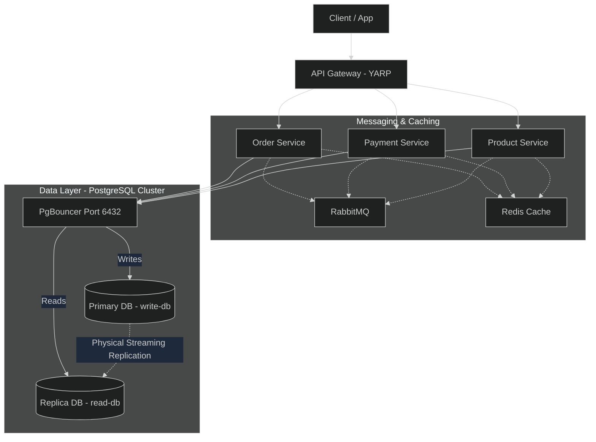
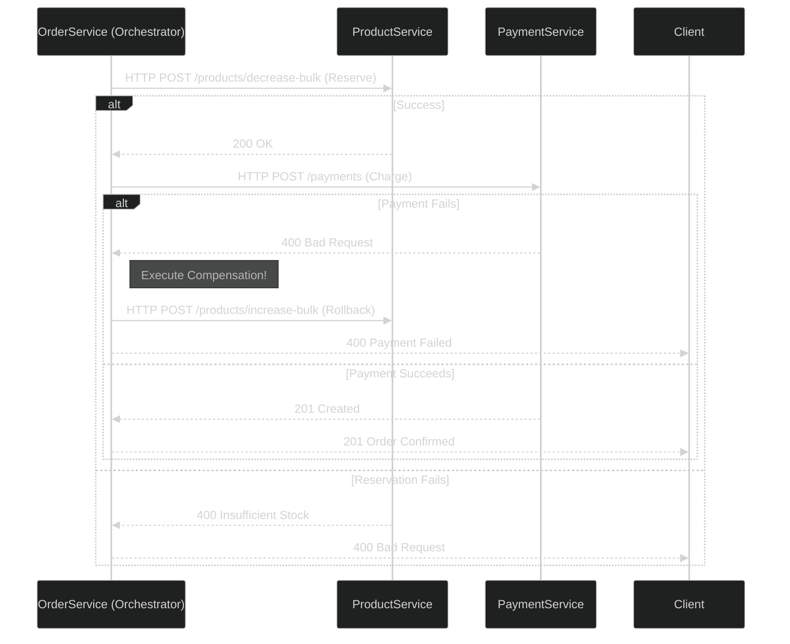
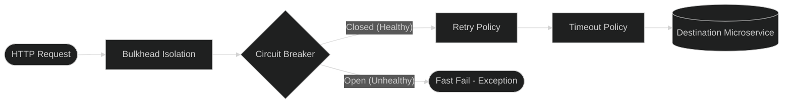
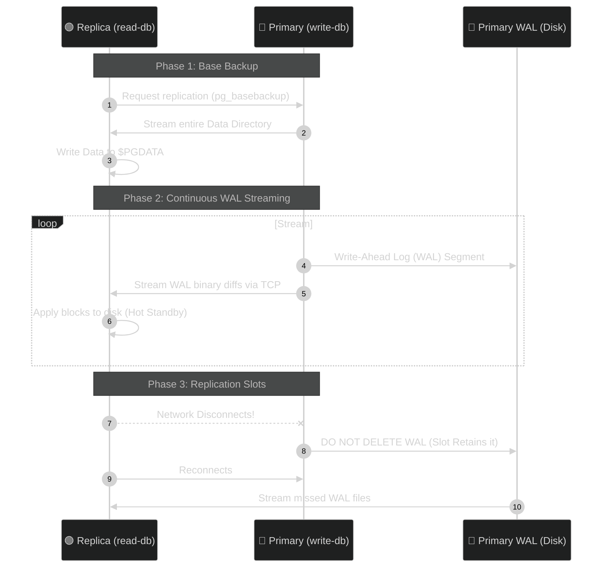
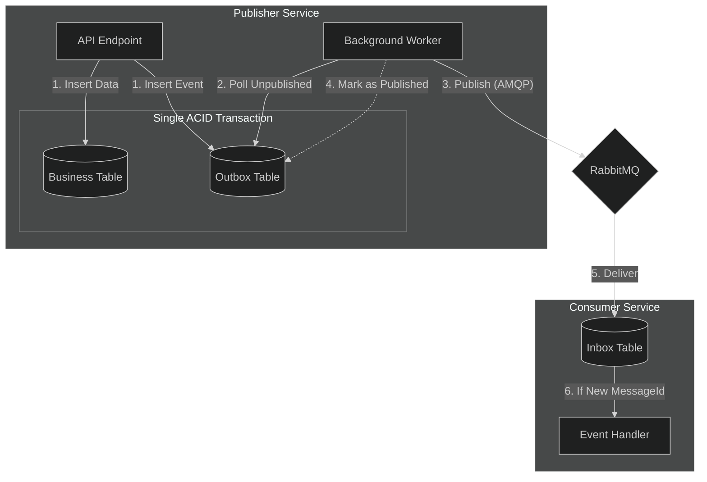
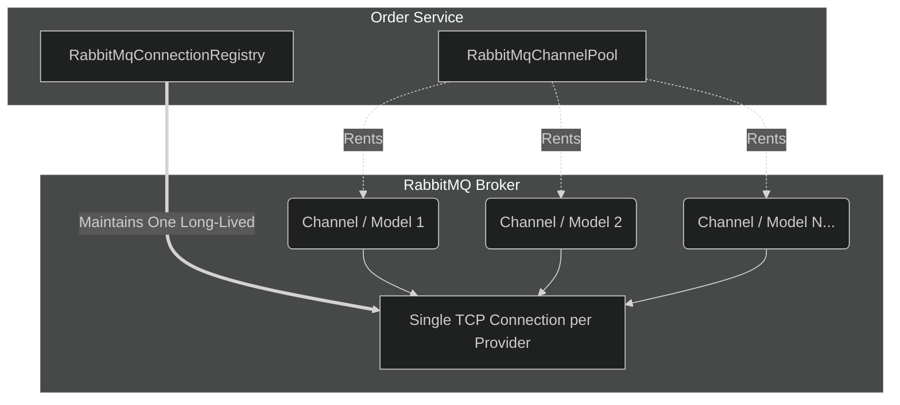
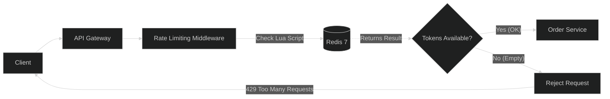

  <h1>🛍️ Enterprise Microservices Architecture</h1>
  
<strong>A production-ready, highly scalable, and resilient distributed e-commerce platform built to demonstrate advanced microservice design patterns.</strong>

---

## 🌟 Overview & Business Value

This repository serves as a comprehensive portfolio piece demonstrating the architectural design, implementation, and deployment of a modern distributed system. It solves complex distributed systems challenges such as **data consistency across boundaries**, **network failure resilience**, **connection pooling at scale**, and **multi-tenant data isolation**.

### 🛠️ Technology Stack
- **Core**: .NET 8, C#, ASP.NET Core Web API
- **Databases**: PostgreSQL 16 (Primary & Physical Replicas), PgBouncer
- **Caching & Rate Limiting**: Redis 7
- **Message Broker**: RabbitMQ 3 (AMQP)
- **Gateway**: YARP (Yet Another Reverse Proxy)
- **Containerization**: Docker & Docker Compose
- **Resilience**: Polly

---

## 1. High-Level Architecture Topology

The platform consists of three independently deployable bounded contexts (Microservices) and a centralized API Gateway.

> [!IMPORTANT]
> **Data Access Rule**: All database traffic (both READ and WRITE) routes through **PgBouncer** to prevent PostgreSQL connection exhaustion. 

### Component Breakdown
- **API Gateway (YARP)**: The single ingress point. It offloads cross-cutting concerns like SSL termination, global rate limiting, and multi-tenant HTTP header injection (`X-Country`).
- **Order Service (Orchestrator)**: Manages the `CreateOrder` Saga, maintaining state and triggering compensations on failure.
- **Payment Service**: Processes financial transactions idempotently. 
- **Product Service**: Manages the catalog cache and inventory stock decrements.

---

## 2. Distributed Transactions: Saga Pattern

In a microservices architecture, traditional 2-Phase Commit (2PC) distributed locks are an anti-pattern due to poor scalability and single points of failure. This platform leverages the **Saga Pattern** to ensure eventual consistency.

We use **both** Saga Orchestration and Saga Choreography, applying each where its trade-offs make the most sense.

### A. Saga Orchestration (The Order Creation Flow)
We use **Orchestration** when we need strict, centralized control and immediate synchronous feedback for the client (e.g., when a user clicks "Checkout"). 

The `OrderService` acts as the central brain. It persists the state of the transaction in `Saga` and `SagaStep` tables. It executes synchronous HTTP commands to the `ProductService` and `PaymentService`.

**Compensation (Rollback) Logic:**
If `PaymentService` fails (e.g., card declined), the `OrderService` explicitly calls a compensation endpoint on `ProductService` to restore the deducted stock, ensuring the system returns to a consistent state.

### B. Saga Choreography (Domain Events)
We use **Choreography** for downstream, loosely-coupled side effects. When an order completes, it broadcasts an `OrderCreated` event to RabbitMQ. Any service (like a Notification or Analytics service) can subscribe and react without the Order Service ever knowing about them.

---

## 3. Advanced HTTP Resilience (Polly Pipelines)

Synchronous network calls are inherently unreliable. This project deeply integrates **Polly** into the `HttpClient` factory (`OutboundHttpServiceCollectionExtensions.cs`) to prevent cascading failures.

### Tailored Pipelines
We don't use a "one size fits all" timeout. Pipelines are tailored to the idempotency and risk of the downstream operation.

1. **Write Pipeline**: Used for generic state mutations (e.g., deducting stock). 
   - *Config*: 0 Retries, 12s Timeout, Standard Circuit Breaker.
   - *Rationale*: Retrying `POST` requests blindly over the network can lead to double-deductions if the initial request succeeded but the response timed out. We rely on Saga Compensation instead of HTTP retries.
2. **NoRetry Pipeline (Payments)**: Used for financial transactions.
   - *Config*: Strict 0 Retries, 10s Timeout, Aggressive Circuit Breaker.
   - *Rationale*: We NEVER auto-retry credit card charges. We fail fast and allow the orchestrator to trigger a refund/rollback.

---

## 4. CQRS & Physical Database Replication

The database architecture is designed to handle a massive disparity between Read and Write operations (common in E-Commerce where catalog browsing vastly outnumbers checkouts).

### Connection Pooling with PgBouncer
Instead of each microservice opening hundreds of direct TCP connections to PostgreSQL, they connect to **PgBouncer** (Port 6432) operating in transaction-pooling mode. This multiplexes thousands of lightweight service connections onto a small number of real database connections, drastically reducing PostgreSQL memory overhead.

### Physical WAL Streaming
This project utilizes **Physical Streaming Replication** (not logical). The replica is a bit-for-bit exact binary copy of the primary database.

- **Replication Slots**: Created via `pg_basebackup -S slot_name`. This is a critical production safety net. If the replica goes offline, the slot forces the primary to retain the WAL (Write-Ahead Log) files until the replica reconnects, guaranteeing it can catch up without a full rebuild.

---

## 5. Atomicity & The Outbox/Inbox Pattern

> [!CAUTION]
> **The Dual-Write Problem**: Saving an order to the database and publishing a RabbitMQ event are two distinct operations. A crash between them results in a permanently inconsistent system.

To solve this, we implement the **Transactional Outbox & Idempotent Inbox** patterns.

1. **Transactional Outbox**: Business data and domain events are committed to PostgreSQL in the *exact same ACID transaction*. A background worker safely pushes the outbox messages to RabbitMQ, providing at-least-once delivery guarantees.
2. **Idempotent Inbox**: The Consumer service inserts the `MessageId` into its `Inbox` table. Because `MessageId` is a Unique Constraint, duplicate RabbitMQ deliveries safely fail at the database level, ensuring exactly-once processing.

---

## 6. Optimized RabbitMQ Connection Architecture

Default .NET RabbitMQ implementations often suffer from connection leaks. This project features a highly optimized TCP pooling layer.

1. **`IRabbitMqConnectionRegistry`**: TCP connections are expensive. The registry creates exactly **one `IConnection` per RabbitMQ provider** (tenant) and keeps it alive.
2. **`IChannelPool`**: Channels (`IModel`) are multiplexed inside the TCP connection, but they are not thread-safe. We use a `ConcurrentBag<IModel>` to allow threads to `Rent()` a channel, publish their event, and `Return()` it efficiently without opening new ports.

---

## 7. Distributed Rate Limiting (Redis)

To protect the system from DDoS or noisy neighbors, the API Gateway implements a **Token Bucket Rate Limiter**.

- **Why Redis?** Local in-memory rate limiting fails in a multi-instance Gateway deployment (traffic is load-balanced). Redis ensures a globally consistent rate limit per IP or User.
- **Lua Scripts**: The token deduction logic is executed inside a Lua script on the Redis server, guaranteeing strict atomicity and preventing race conditions under heavy concurrent load.

---

## 8. Seamless Multi-Tenancy

The platform serves multiple distinct countries (Egypt and USA) entirely dynamically, enforcing strict data isolation.

1. **HTTP Routing**: A custom `HeaderPropagationHandler` intercepts all outgoing microservice HTTP calls and automatically attaches the `X-Country` header.
2. **Database Isolation**: Depending on the header, PgBouncer routes the request to isolated databases (e.g., `ProductDb` vs `ProductDb-USA`).
3. **Broker Isolation**: RabbitMQ initialization scripts generate tenant-specific exchanges and queues (e.g., `Egypt.order.exchange`). This isolates asynchronous workloads, ensuring a traffic spike in the USA does not delay processing in Egypt.
