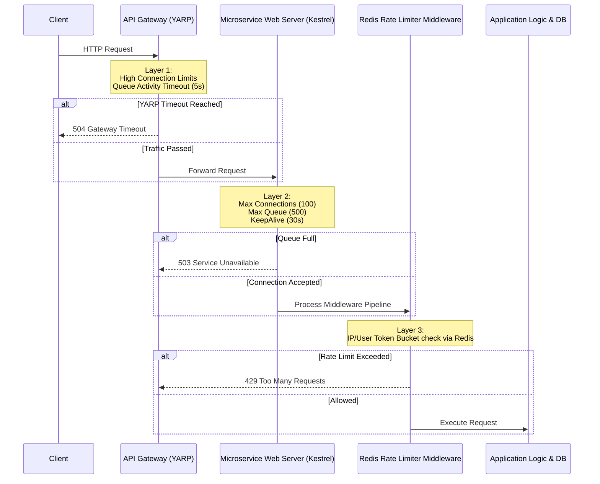
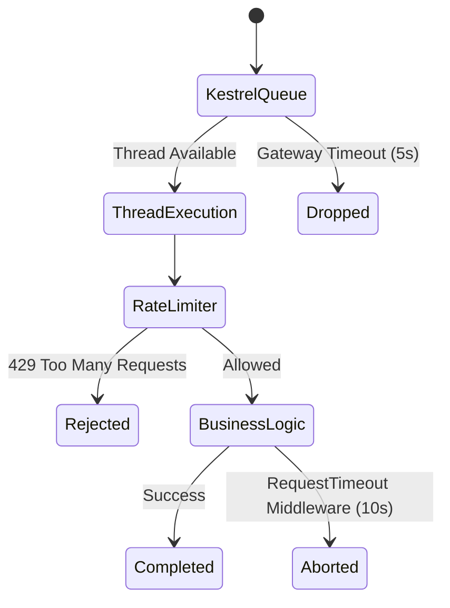

# Microservices Protection Architecture & Rate Limiting

This document outlines the 3-Layer Protection Architecture implemented across the microservices ecosystem. It explains the design decisions, the mechanisms in place to protect system resources, and the rationale behind each choice based on the context of building a resilient distributed system.

## The 3-Layer Protection Flow

When a client sends a request, it passes through three distinct layers of defense before reaching any expensive business logic or database operations.

---

## Decision 1: Placing the Rate Limiter in the Microservices

**Question:** Why did we place the Rate Limiter in the individual Microservices instead of centralizing it at the API Gateway?

**Rationale:** 
The primary goal of this specific rate limiter is to protect against *business-level abuse* (e.g., a user creating too many orders), not just raw DDoS attacks. 
1. **Authentication Awareness:** The microservices already validate the JWT tokens. By placing the middleware here, we can automatically extract the `UserId` from the claims. If we placed this at the Gateway, we would have to duplicate the JWT validation logic at the Gateway level just to read the user ID.
2. **Dynamic Granularity:** An anonymous request is limited by IP (`rl:ip:{ip}`), while an authenticated request is strictly limited by User (`rl:user:{userId}`). This perfectly handles the NAT/Shared IP problem, allowing hundreds of users behind a single corporate IP to operate normally, as long as they are authenticated.

---

## Decision 2: Adding Kestrel Timeouts and Queue Limits

**Question:** Why did we configure Kestrel connection limits and timeouts (`KeepAliveTimeout` and `RequestHeadersTimeout`) inside `appsettings.json`?

**Rationale:**
- **`MaxConcurrentConnections` & `RequestQueueLimit`:** If traffic spikes massively, Kestrel will queue up to 500 requests. If the queue is full, Kestrel instantly rejects new connections. This protects the thread pool from being completely overrun.
- **`KeepAliveTimeout`:** Dropped to 30 seconds. If a client opens a TCP connection but sits idle, it consumes a connection slot. Dropping it fast frees up space for legitimate traffic.
- **`RequestHeadersTimeout`:** Protects against "Slowloris" attacks, where an attacker intentionally sends request headers byte-by-byte to hold the connection open forever.

---

## Decision 3: The "Ghost Execution" and Timeout Middleware

**Question:** If a million requests come in, they consume threads. How does the Rate Limiter protect resources, and what happens if a request is stuck in the queue?

**Rationale:**
1. **Thread Pool Economics:** I/O threads in Kestrel are cheap, but Database connections and CPU-heavy logic are incredibly expensive. The Rate Limiter executes a ~1ms Redis call and returns `429 Too Many Requests`. This immediately releases the thread back to the Thread Pool *before* it can hit the database.
2. **The 5-Second Gateway Timeout:** We configured the Gateway (`YARP`) with a 5-second `ActivityTimeout`. If a request is stuck in the microservice's Kestrel queue for > 5 seconds, YARP aborts the connection. Kestrel instantly drops it from the queue without ever executing it!
3. **The .NET 8 Request Timeouts Middleware:** If a request actually starts executing but takes too long (e.g., 10 seconds), this middleware fires a Cancellation Token (`HttpContext.RequestAborted`). This safely aborts the database query in-flight, preventing ghost executions from hanging around in the background and wasting resources.

---

## Decision 4: Using a Redis Lua Script (Token Bucket)

**Question:** Why use a Lua Script in Redis for the Token Bucket algorithm?

**Rationale:**
- **Atomicity:** In a distributed system with multiple replicas of `OrderService`, two requests for the same User ID might arrive at exactly the same millisecond. If we read the tokens, calculated the new amount, and saved it back from C#, it would cause a race condition (over-allocating tokens). 
- **The Lua Advantage:** A Lua script runs sequentially and atomically inside the Redis engine. The entire Read -> Calculate -> Deduct -> Write operation happens as a single guaranteed transaction.
- **Server Clock Drift:** The Lua script uses `redis.call('TIME')` rather than the application server's clock. This ensures that even if Microservice A and Microservice B have clocks that are out of sync by 2 seconds, the rate limiter's calculations remain perfectly accurate based on the central Redis clock.
