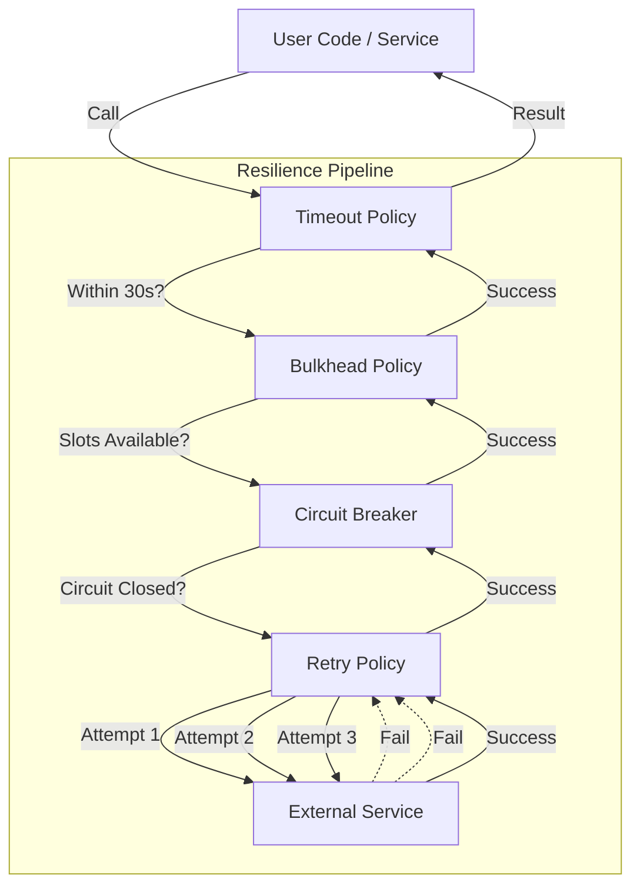

# HTTP Resilience Policies Documentation

This document explains the resilience patterns implemented in `Micro.Shared/Http/Policies/PollyPolicies.cs` and how they are applied to HTTP Clients in the microservices architecture.

## Overview

We use **Polly** to handle transient failures and prevent cascading failures across services. The policies are configured via extension methods in `HttpClientExtensions.cs`.

## Policies Explained

### 1. Retry Policy

- **Purpose**: Handles temporary network glitches or momentary 5xx errors.
- **Behavior**:
  - Retries **3 times**.
  - **Exponential Backoff**: 1s, 2s, 4s delays.
  - **Triggers**: 5xx HTTP codes, 408 (Request Timeout), and network exceptions.
- **Benefit**: "Self-healing" for minor issues.

### 2. Circuit Breaker Policy

- **Purpose**: "Fail fast" to protect a downstream service that is down.
- **Behavior**:
  - **Opens** after **5 consecutive failures** (exceptions or failing HTTP status codes).
  - **Break Duration**: **30 seconds**.
  - **Half-Open**: Allows one test request after 30s. If it succeeds, the circuit closes (resets).
- **Benefit**: Prevents resource exhaustion and gives the failing service time to recover.

### 3. Timeout Policy

- **Purpose**: Prevents requests from hanging indefinitely.
- **Behavior**:
  - Default limit: **30 seconds**.
  - Throws `TimeoutRejectedException` if exceeded.
- **Benefit**: Frees up threads and connection slots.

### 4. Bulkhead Policy

- **Purpose**: Throttling to prevent one service from consuming all resources.
- **Behavior**:
  - **Max Parallelization**: **10** concurrent requests.
  - **Max Queue**: **20** requests waiting.
  - Excess requests are rejected immediately.
- **Benefit**: Isolates faults; if Service A is slow, it won't crash Service B by using up all its threads.

---

## Execution Order (The "Pipeline")

Unlikely manual wrapping, when using `AddPolicyHandler` in ASP.NET Core, policies are executed **in the order they are added**.

In `HttpClientExtensions.cs`, the order is:

1. **Timeout** (Outer)
2. **Bulkhead**
3. **Circuit Breaker**
4. **Retry** (Inner)

### Visual Flow

### Real-World Scenario Walkthrough

#### Scenario A: Temporary Glitch (Success)

1. **Timeout**: Starts a 30s timer.
2. **Circuit Breaker**: Checks status. It's Closed (Healthy). Passes through.
3. **Retry**: Calls the API.
4. **Network**: Fails with `503 Service Unavailable`.
5. **Retry**: Catches the 503. Waits **1 second**.
6. **Retry**: Calls the API again (Attempt 2).
7. **Network**: Returns `200 OK`.
8. **Retry**: Returns success.
9. **Circuit Breaker**: Sees a successful call (failure count remains 0).
10. **Timeout**: Request finished in 1.2s (well within 30s). Returns to caller.

    _Result_: The user sees a slightly slower 200 OK. No error logged as "Failure".

#### Scenario B: Service Down (Circuit Breaks)

1. **Retry** tries 3 times and fails all of them.
2. **Retry** gives up and re-throws the exception.
3. **Circuit Breaker**: Sees the exception. Increments failure count (1/5).
4. ... (Repeats for 4 more requests) ...
5. **Circuit Breaker**: Failure count hits 5. **State changes to OPEN**.
6. **Next Request**:

   - **Timeout**: Starts.
   - **Circuit Breaker**: Immediately throws `BrokenCircuitException`.
   - **Retry**: Never runs.
   - **Network**: Never called.

   _Result_: Fast failure. The application doesn't waste time waiting for timeouts.

#### Scenario C: Slow Service (Timeout)

1. **Timeout**: Starts 30s timer.
2. ... Policies pass through ...
3. **Retry**: Calls Network.
4. **Network**: Hangs... 5s... 10s... 30s.
5. **Timeout**: Timer fires. Cancels the execution. Throws `TimeoutRejectedException`.

   _Result_: Request aborted. Resources freed.
