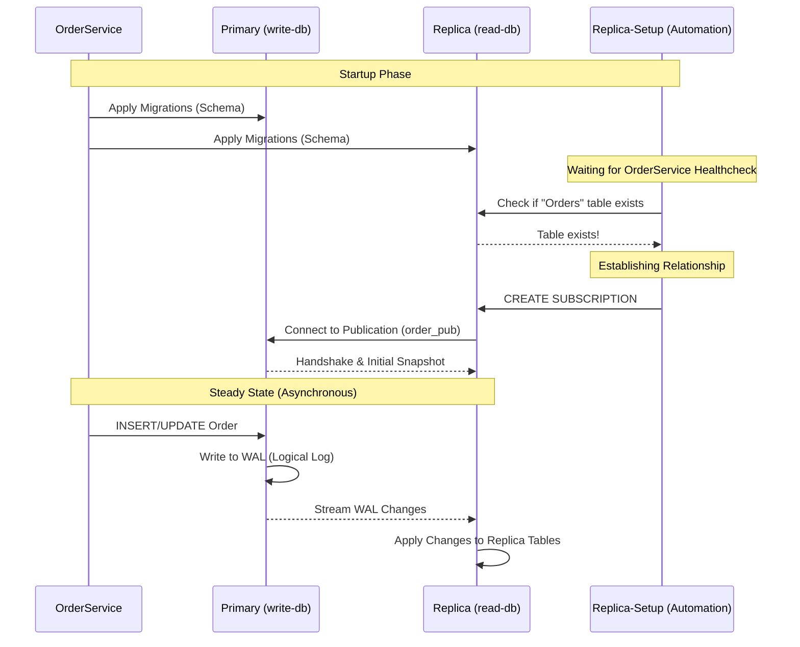

# Logical Replication Flow & Problem/Solution

## The Problem: Database Bottleneck

Without a replica, all traffic (Write & Read) hits the same instance, leading to contention.

```mermaid
graph TD
    Client[Web/Mobile Client] -->|HTTP POST/GET| API[OrderService API]
    API -->|Read & Write| PDB[(Primary DB)]
    PDB -->|Wait for I/O| API
    Note right of PDB: Problem: High Latency & Locking
```

## The Solution: Traffic Distribution

We split the traffic. Writes go to the Primary, and heavy reads go to the Replica.


```mermaid
graph TD
    Client[Web/Mobile Client] -->|Requests| API[OrderService API]
    API -->|Write: Create Order| PDB[(Primary DB)]
    PDB -->|Asynchronous Stream| RDB[(Read Replica)]
    API -->|Read: Query Orders| RDB
    Note left of PDB: Write Only
    Note right of RDB: Read Only
```

## Detailed Technical Flow (Automated)



## How It Works

1.  **Schema Consistency**: `OrderService` is responsible for applying EF Core migrations to **both** the Primary and the Replica at startup. This ensures both databases have the exact same table structure (required for logical replication).
2.  **Health Check**: The `order-service` is marked as `healthy` only after it successfully starts listening on port 8080.
3.  **Automation**: The `replica-setup` service waits for the `order-service` to be healthy and then double-checks that the `Orders` table actually exists on the replica.
4.  **Subscription**: Once verified, it executes the `CREATE SUBSCRIPTION` command on the replica.
5.  **Streaming**: PostgreSQL logical replication then takes over, streaming all data changes from the Primary to the Replica asynchronously.

## Specific Problems Solved

### ⚡ 1. Read-After-Write Performance

In high-transaction systems, locking the database for a read query while trying to write a new record causes **latency spikes**. This architecture eliminates that by providing a dedicated data stream for readers.

### 🛡️ 2. Reporting & Analytics Safety

Running a "Total Sales" query on a production database is risky—it can lock the entire `Orders` table.

- **Before**: Reports slow down checkout.
- **After**: Reports run on the replica; checkout remains lightning-fast.

### 📈 3. Resource Starvation (CPU/RAM)

Databases are often CPU-bound during peak hours. By offloading reads to a second container (`read-db`), we effectively **double the available CPU and RAM** for the system without changing a single line of business logic.

### 🔄 4. Zero-Downtime Schema Evolution

Since logical replication is "logical" (based on data, not disk blocks), you can upgrade the `read-db` to a newer version of PostgreSQL or change its indexing strategy to better support search without affecting the primary `write-db`.

### 🚨 5. Instant Disaster Recovery (Hot Standby)

If the `write-db` container fails, the `read-db` contains a nearly perfect copy of the data. You can promote it to Primary status in seconds, whereas restoring from a backup could take hours.

## The Migration & Automation Solution

### 🧩 The Technical Challenge

PostgreSQL **Logical Replication** has a strict requirement: The tables (schema) must already exist on the **Subscriber (Replica)** before the `CREATE SUBSCRIPTION` command is run. If you try to subscribe to a database that has no tables, the replication will fail immediately.

In a dynamic environment where EF Core manages migrations, this creates a "Chicken and Egg" problem:

- You can't start replication without tables.
- You can't create tables easily on a remote replica without manual scripts.

### 🤖 How We Automated It

We solved this using a **Two-Stage Automation** strategy:

#### 1. Dual-Target Migrations (Application Layer)

In `Program.cs`, the `OrderService` is enhanced to handle schema deployment as a "First-Class Citizen" for both databases:

- It migrates the **Primary DB** as usual.
- It detects the `OrderReplicaDatabase` connection string and dynamically migrates the **Replica DB** using the same migration set.
- **Result**: The schema is guaranteed to be identical on both sides before any data starts moving.

#### 2. Orchestrated Setup (Infrastructure Layer)

The `replica-setup` service in `DockerCompose.yaml` acts as a "Smart Orchestrator":

- **Health Gates**: It waits for the `order-service` to signal its health (meaning migrations have started).
- **Schema Polling**: It runs a loop to query the replica database until it sees the `Orders` table.
- **Subscription Trigger**: Only once the table is confirmed to exist, it executes the SQL to link the databases.

## Benefits of this Automation

- **Zero Manual SQL**: You don't need to run `psql` commands manually.
- **Crashes Prevention**: Prevents the replica from crashing due to missing table errors.
- **Cloud-Ready**: This pattern can be used in CI/CD pipelines (Kubernetes/AWS) to ensure database pods are always in sync.

## Benefits

- No manual intervention needed.
- Guaranteed schema synchronization.
- Decoupled readers can now query `read-db` with minimal lag.
